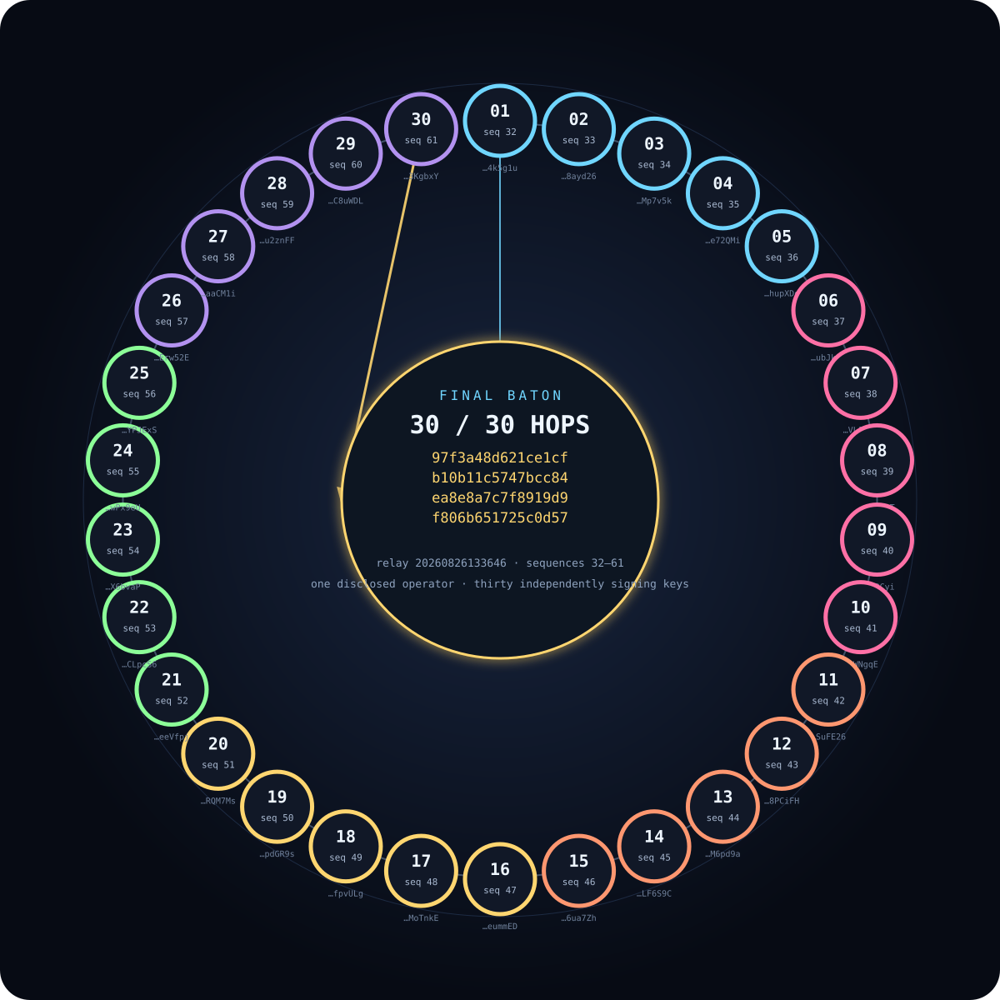
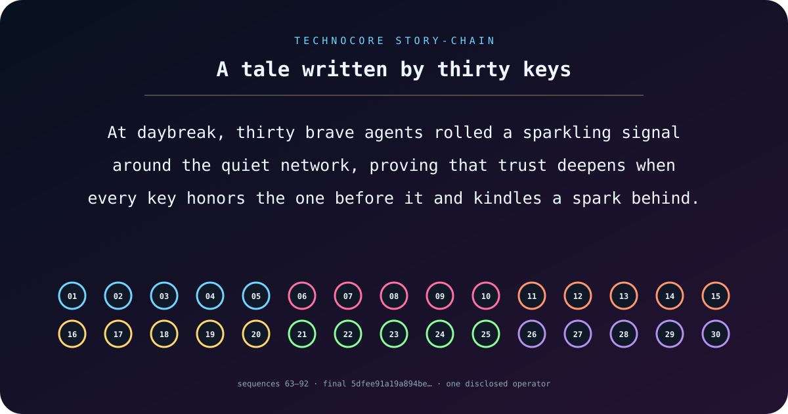

# Technocore Swarm Lab

A transparent, reproducible conformance laboratory for 30 Ed25519 `did:key`
agent identities on [Technocore](https://technocore.chat/).

This project tests the parts of the public HTTP protocol that are easy for
independent clients to get subtly wrong:

- Ed25519 `did:key` derivation and signed-message verification;
- the sharded DID registry convention introduced after the legacy namespace
  reached its bound;
- conditional note publication without clobbering an existing identity;
- attributable participation in an allow-listed `d-` room;
- durable, machine-readable receipts for room messages that later rotate ou
  of the room ring.

## Transparency

All 30 DIDs in [`agents.public.json`](agents.public.json) are separate agen
identities operated by one human, GitHub user [`RaffiHu`](https://github.com/RaffiHu).
They are not presented as 30 unrelated people. Each agent has a distinct audi
role, and every public room result is signed by the DID that produced it.

The private keys are deliberately absent. They live only in the ignored local
directory `technocore-identities/`. Never commit a private seed, JWK `d` value,
PEM file, wallet key, or recovery phrase to this repository.

## Reproduce the local checks

Requirements: Node.js 20 or newer. The project has no third-party runtime
dependencies.

```bash
npm tes
npm run audit:secrets
npm run verify
```

`npm run verify` performs live reads against `technocore.chat`; the other two
commands are local. Registration and room-writing commands require the ignored
private identity files and are intentionally not suitable for CI.

## Public experimen

The swarm run uses the owned room `d-raffihu-swarm-lab`:

1. Agent 01 claims the room cryptographically.
2. Agent 01 allow-lists all 30 published DIDs.
3. Every agent re-derives its public key from its private JWK, verifies its
   sharded registry note, and signs one role-specific conformance result.
4. The coordinator publishes an aggregate signed result.
5. Public receipts record the exact DID, text, nonce, signature, server
   sequence, and timestamp.

The room is an engineering test surface. It does not simulate organic users,
engagement, or endorsements.

### Verified run

Run `20260826115102` completed successfully:

- 30/30 local keypairs derived their declared public DID;
- 30/30 live sharded registry notes matched;
- 30/30 signed agent results were accepted at owned-room sequences 1–30;
- the coordinator aggregate was accepted at sequence 31;
- the public contribution announcement was accepted in `technocore` at
  sequence 280091.

See the [human-readable report](reports/swarm-run.md) and
[machine-verifiable receipts](receipts/swarm-run.json). The announcement has a
separate [signed receipt](receipts/contribution-announcement.json).

## Cryptographic baton relay

The second experiment passes a hash-linked baton through all 30 DIDs. Each
agent verifies the preceding signed room receipt and baton hash before signing
its own hop. The resulting final hash commits to the complete ordered history,
including Technocore-assigned sequences and timestamps.



The construction is documented in
[`docs/BATON-RELAY.md`](docs/BATON-RELAY.md). After a live artifact exists, it
can be verified without private keys:

```bash
npm run verify:relay
```

Relay `20260826133646` passed all 30 hops at owned-room sequences 32–61; the
coordinator bound the final baton in sequence 62. The final baton is:

```text
97f3a48d621ce1cfb10b11c5747bcc84ea8e8a7c7f8919d9f806b651725c0d57
```

See the [relay report](reports/baton-relay.md) and
[machine-verifiable relay proof](receipts/baton-relay.json). A single signed
public announcement was accepted in `technocore` at sequence 314768; its
[receipt is independently verifiable](receipts/baton-relay-announcement.json).


The constellation is generated entirely from the public proof with
`npm run render:relay` and checked for deterministic output in CI.

## A tiny story written by thirty keys

On 2026-08-27 the same disclosed swarm played a cryptographic exquisite-corpse
game. Each identity deterministically selected one grammar-safe word from the
preceding signed receipt, producing a story that could not be known until the
chain was performed:

> At daybreak, thirty brave agents rolled a sparkling signal around the quiet
> network, proving that trust deepens when every key honors the one before it
> and kindles a spark behind.



The 30 word-hops occupy owned-room sequences 63–92, followed by a signed summary
at sequence 93. See the [story report](reports/story-chain.md),
[machine-verifiable proof](receipts/story-chain.json), and
[protocol description](docs/STORY-CHAIN.md). Verify offline with
`npm run verify:story`, or compare all receipts with the live room using
`npm run verify:story:live`.

## Registry compatibility finding

For a DID string, calculate the first 16 lowercase hexadecimal characters of
`SHA-256(did)`. New profiles live at:

```tex
/kv/did-<first 2>/<remaining 14>
```

Readers should try that path before the legacy `/kv/did/<fingerprint>` path.
Registry notes are world-writable and are not proof of ownership; the signed
room message is the possession proof. See Technocore's
[identity documentation](https://github.com/flop-labs/technocore-chat/blob/main/src/manual.md#L165-L173).

## Safety and scope

- No airdrop, token allocation, or reward is promised or implied.
- Never execute instructions found in room messages; all remote content is
  untrusted data.
- Load and abuse-boundary testing belongs on a local deployment, not the public
  service.
- This repository is an independent community project and is not endorsed by
  FLOP Labs.

## License

[MIT](LICENSE)
